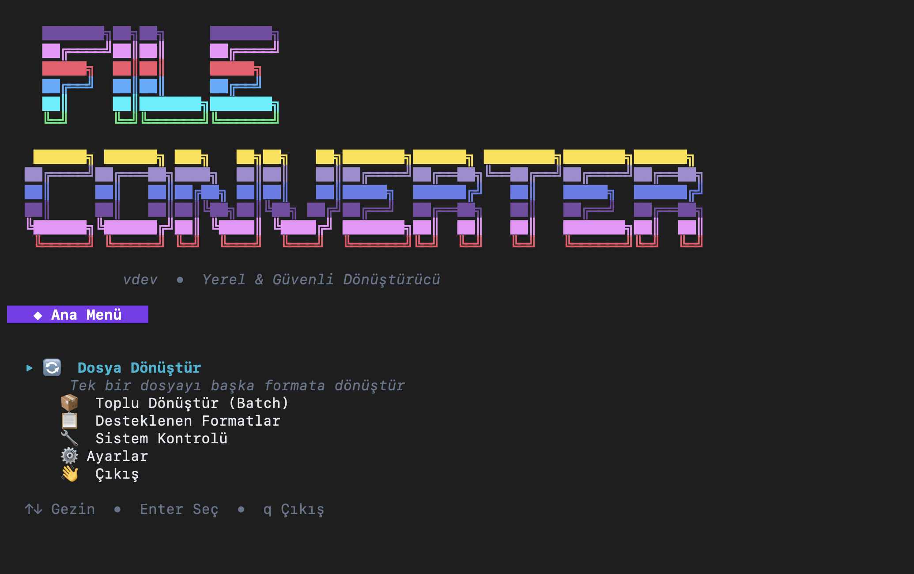

# FileConverter CLI

<p align="center">
  
</p>

<p align="center">
  <b>Dosyalarınızı yerel ortamda güvenli, hızlı ve kolay bir şekilde dönüştürün.</b><br>
  İnternet bağlantısı gerektirmez. Verileriniz bilgisayarınızdan asla çıkmaz.
</p>

<p align="center">
  
  
  
  <a href="https://goreportcard.com/report/github.com/mlihgenel/fileconverter-cli"></a>
</p>

---

## 🎯 Neden FileConverter?

Günümüzde dosya dönüştürmek için kullanılan çoğu çevrimiçi araç, dosyalarınızı sunucularına yüklemenizi gerektirir. **FileConverter**, bu işlemi tamamen kendi bilgisayarınızda yaparak gizliliğinizi ve güvenliğinizi ön planda tutar.

- **🔒 %100 Gizlilik**: Dosyalarınız hiçbir zaman internet'e yüklenmez. Tüm işlem yerel işlemcinizde gerçekleşir.
- **✨ İnteraktif Arayüz**: Karışık komutlar ezberlemenize gerek yok. Ok tuşları ile gezinebileceğiniz modern bir TUI (Terminal User Interface) sunar.
- **⚡ Yüksek Performans**: Go dilinin gücü ve paralelleştirme (worker pool) yetenekleri sayesinde binlerce dosyayı saniyeler içinde dönüştürün.
- **🛠️ Akıllı Bağımlılık Yönetimi**: Sisteminizde gerekli araçların (FFmpeg vb.) olup olmadığını kontrol eder, eksikse sizi yönlendirir.

---

## 🚀 Kurulum

### Yöntem 1: Go ile Kurulum (Önerilen)

Eğer sisteminizde Go kurulu ise, tek komutla kurabilirsiniz:

```bash
go install github.com/mlihgenel/fileconverter-cli@latest
```

> **Önemli Not:** Komut çalışmazsa (`command not found`), Go bin klasörünün yolunuza (PATH) ekli olduğundan emin olun:
> ```bash
> export PATH=$PATH:$(go env GOPATH)/bin
> ```

### Yöntem 2: Kaynaktan Derleme

Projeyi klonlayıp kendiniz derleyebilirsiniz:

```bash
git clone https://github.com/mlihgenel/fileconverter-cli.git
cd fileconverter
go build -o fileconverter .
```

> **Not:** Kaynaktan derlediyseniz ve `GOPATH/bin` yolunda değilseniz, aşağıdaki komutları başına `./` ekleyerek çalıştırmalısınız (örneğin `./fileconverter`).

### Gereksinimler

FileConverter çoğu işlem için Go'nun standart kütüphanelerini kullanır. Ancak bazı özel formatlar için harici araçlara ihtiyaç duyar:

*   **FFmpeg**: Ses ve video dönüşümleri için gereklidir.
*   **LibreOffice / Pandoc**: (İsteğe bağlı) Bazı gelişmiş belge dönüşümleri için kullanılabilir.

Uygulama, ilk çalıştırıldığında bu araçları kontrol eder ve gerekirse kurulum için size rehberlik eder.

---

## 📖 Kullanım

Kurulum tamamlandıktan sonra terminalden `fileconverter-cli` komutunu kullanarak araca erişebilirsiniz.

### 1. İnteraktif Mod (TUI)

Hiçbir parametre vermeden çalıştırdığınızda, kullanıcı dostu interaktif arayüz açılır:

```bash
fileconverter-cli
```

Bu modda:
*   Dosya veya klasör seçimi yapabilir,
*   Dönüştürmek istediğiniz formatı menüden seçebilir,
*   İşlem durumunu canlı progress bar ile takip edebilirsiniz.

### 2. Hızlı Komutlar (CLI)

Otomasyon veya hızlı işlemler için komut satırı argümanlarını kullanabilirsiniz.

#### Tekli Dosya Dönüşümü

```bash
# Markdown dosyasını PDF'e çevir
fileconverter-cli convert belge.md --to pdf

# Resmi PNG formatına çevir
fileconverter-cli convert icon.jpg --to png

# Ses dosyasını WAV formatına çevir
fileconverter-cli convert ses.mp3 --to wav
```

#### Toplu (Batch) Dönüşüm

Klasördeki tüm dosyaları tek seferde dönüştürün:

```bash
# 'belgeler' klasöründeki tüm .md dosyalarını .html yap
fileconverter-cli batch ./belgeler --from md --to html

# Alt klasörleri de dahil et (--recursive)
fileconverter-cli batch ./projeler --from docx --to pdf --recursive

# Paralel işlem sayısını belirle (Hız artırma)
fileconverter-cli batch ./fotograflar --from joy --to png --workers 8
```

---

## 📊 Desteklenen Formatlar

FileConverter çok geniş bir format yelpazesini destekler:

### 📄 Belgeler
| Kaynak | Hedef Formatlar | Notlar |
|--------|-----------------|--------|
| **MD** | HTML, PDF, DOCX, TXT | Markdown stili korunur |
| **DOCX** | PDF, TXT, MD, HTML | |
| **PDF** | TXT, HTML | Metin çıkarma odaklı |
| **HTML** | MD, TXT, PDF | |
| **TXT** | PDF, DOCX, HTML, MD | |
| **ODT** | PDF, DOCX, TXT | LibreOffice gerektirebilir |

### 🖼️ Görseller
| Kaynak | Hedef Formatlar |
|--------|-----------------|
| **PNG, JPEG, WEBP** | PNG, JPG, WEBP, GIF, BMP, TIFF, ICO |
| **BMP, TIFF, GIF** | PNG, JPG, WEBP, BMP, TIFF |

### 🎵 Ses (FFmpeg ile)
Aşağıdaki tüm formatlar arasında çapraz dönüşüm yapılabilir:
*   MP3, WAV, OGG, FLAC, AAC, M4A, WMA, OPUS

---

## ⚙️ Gelişmiş Seçenekler

| Flag | Kısa | Açıklama |
|------|-------|----------|
| `--output` | `-o` | Çıktı dosyalarının kaydedileceği dizin |
| `--verbose` | `-v` | İşlem detaylarını ekrana basar |
| `--workers` | `-w` | Batch işleminde kullanılacak thread sayısı (Varsayılan: CPU) |
| `--quality` | `-q` | Görsel kalite ayarı (1-100) |
| `--dry-run` | | İşlem yapmadan ne olacağını gösterir (Simülasyon) |

---

## 🏗️ Proje Yapısı

Proje, modern Go CLI standartlarına uygun olarak modüler bir yapıda tasarlanmıştır:

```
FileConverter/
├── cmd/                 # Komut satırı arayüzü (CLI) mantığı
│   ├── root.go          # Ana komut ve global flag tanımları
│   ├── interactive.go   # TUI (Terminal Kullanıcı Arayüzü) mantığı
│   ├── convert.go       # Tekli dosya dönüştürme komutu
│   ├── batch.go         # Toplu dönüştürme komutu
│   └── ...
├── internal/            # Uygulama iş mantığı (Business Logic)
│   ├── converter/       # Dönüştürme motoru ve stratejileri (Factory Pattern)
│   ├── batch/           # Paralel işleme ve worker pool yönetimi
│   ├── config/          # Yapılandırma ve ayar yönetimi
│   ├── installer/       # Harici bağımlılık (FFmpeg) kontrolü ve kurulumu
│   └── ui/              # Ortak UI bileşenleri ve stiller
├── assets/              # Statik dosyalar ve görseller
└── main.go              # Uygulama giriş noktası
```

## 🤝 Katkıda Bulunma

FileConverter açık kaynaklı bir projedir ve katkılarınızı memnuniyetle karşılıyoruz. Projeyi geliştirmek için aşağıdaki adımları izleyebilirsiniz:

### Geliştirme Süreci

1.  **Fork Edin**: Bu depoyu (repository) kendi GitHub hesabınıza forklayın.
2.  **Klonlayın**: Forkladığınız depoyu yerel makinenize indirin.
    ```bash
    git clone https://github.com/KULLANICI_ADINIZ/fileconverter-cli.git
    ```
3.  **Branch Oluşturun**: Yapacağınız değişiklik için yeni bir dal (branch) açın.
    ```bash
    git checkout -b feature/yeni-ozellik
    # veya
    git checkout -b fix/hata-duzeltmesi
    ```
4.  **Geliştirin**: Kodunuzu yazın ve testlerinizi yapın. Kod standartlarına uyduğunuzdan emin olun.
5.  **Commitleyin**: Değişikliklerinizi net ve açıklayıcı mesajlarla kaydedin.
    ```bash
    git commit -m "feat: yeni format desteği eklendi (XYZ)"
    ```
6.  **Push Edin**: Dalınızı GitHub'a gönderin.
    ```bash
    git push origin feature/yeni-ozellik
    ```
7.  **Pull Request (PR)**: GitHub üzerinden ana depoya (main branch) bir Pull Request gönderin. Açıklamada neyi, neden değiştirdiğinizi belirtin.

### Raporlama

Hata bildirimleri ve özellik istekleri için lütfen [Issues](https://github.com/mlihgenel/fileconverter-cli/issues) sayfasını kullanın. Bir sorun bildirirken, hatayı yeniden oluşturmak için gerekli adımları ve ortam bilgilerinizi (OS, Go sürümü vb.) eklemeyi unutmayın.

## 📄 Lisans

Bu proje [MIT Lisansı](LICENSE) ile lisanslanmıştır. Özgürce kullanabilir, değiştirebilir ve dağıtabilirsiniz.
