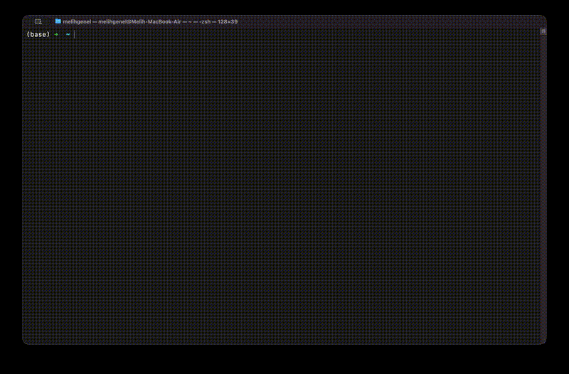

# File Converter CLI

<p align="center">
  
</p> 


<p align="center">
  Belgeleri, görselleri, sesleri ve videoları tamamen yerel ortamda dönüştüren modern bir CLI/TUI aracı.
</p>

<p align="center">
  
  
  
  <a href="https://goreportcard.com/report/github.com/mlihgenel/fileconverter-cli"></a>
</p>

## İçindekiler
- [Genel Bakış](#genel-bakış)
- [Özellikler](#özellikler)
- [Kurulum](#kurulum)
- [Hızlı Başlangıç](#hızlı-başlangıç)
- [Komut Referansı](#komut-referansı)
- [Flag Referansı](#flag-referansı)
- [Desteklenen Formatlar](#desteklenen-formatlar)
- [Harici Bağımlılıklar](#harici-bağımlılıklar)
- [Yapılandırma](#yapılandırma)
- [Sorun Giderme](#sorun-giderme)
- [Geliştirme](#geliştirme)
- [Proje Yapısı](#proje-yapısı)
- [Katkı](#katkı)
- [Lisans](#lisans)

## Genel Bakış
File Converter CLI, dosya dönüştürme işlemlerini internet servislerine yükleme yapmadan yerel makinede gerçekleştiren bir komut satırı uygulamasıdır.

- Gizlilik odaklıdır: dosyalar cihazdan çıkmaz.
- İki kullanım modu sunar: CLI (otomasyon/script) ve interaktif TUI (menü tabanlı).

## Özellikler
- Belge, görsel, ses ve video dönüşümleri.
- `mp4 -> gif` dahil video dönüşümü.
- Video düzenleme (`video trim`): `clip` modunda aralık çıkarır, `remove` modunda aralığı silip kalan parçaları birleştirir.
- Video trim preview/plan: CLI’de `--dry-run/--preview`; TUI’de çalıştırmadan önce plan onayı ekranı.
- Video trim codec stratejisi: `--codec auto` (varsayılan) hedef formata göre uyumlu codec seçer.
- TUI video trim timeline adımı: başlangıç/bitiş aralığını klavye ile hızlı kaydırma ve remove modunda çoklu segment yönetimi (`a/n/p/d/m`).
- Görsel/video boyutlandırma: manuel (`px`/`cm`) veya hazır preset (`story`, `square`, `fullhd` vb.).
- Oranı koruyarak dikey/yatay uyarlama (`pad`, `fit`, `fill`, `stretch`); `pad` modunda siyah boşluk desteği.
- Interaktif ana menüde ayrı akışlar: `Dosya Dönüştür`, `Toplu Dönüştür`, `Klasör İzle`, `Video Düzenle (Klip/Sil)`, `Boyutlandır`, `Toplu Boyutlandır`.
- Batch dönüşüm (dizin veya glob pattern).
- Paralel işleme (`--workers`) ile yüksek performans.
- Ön izleme modu (`--dry-run`) ile risksiz batch planlama.
- Çakışma politikası (`--on-conflict`: `overwrite`, `skip`, `versioned`).
- Otomatik retry (`--retry`, `--retry-delay`) ve raporlama (`--report`, `--report-file`).
- Hazır profil sistemi (`--profile`: `social-story`, `podcast-clean`, `archive-lossless`).
- Metadata kontrolü (`--preserve-metadata`, `--strip-metadata`).
- Klasör izleme ile otomatik dönüşüm (`watch` komutu).
- Proje bazlı ayarlar: `.fileconverter.toml` (flag > env > project config > default).
- Harici bağımlılık kontrolü (FFmpeg, LibreOffice, Pandoc).
- Format alias desteği (`jpeg -> jpg`, `tiff -> tif`, `markdown -> md`).

## Kurulum

### 1. Go ile kurulum (önerilen)
```bash
go install github.com/mlihgenel/fileconverter-cli@latest
```

Kurulum sonrası herhangi bir dizinden çalıştırabilmek için binary yolunun `PATH` içinde olması gerekir.
`go env GOBIN` doluysa o dizini, boşsa `$(go env GOPATH)/bin` dizinini `PATH` içine ekleyin.

### 2. PATH ayarı (herhangi bir dizinden çalıştırmak için)

#### macOS / Linux (zsh veya bash)
```bash
echo 'export PATH="$PATH:$(go env GOPATH)/bin"' >> ~/.zshrc
source ~/.zshrc
```

`bash` kullanıyorsanız `~/.bashrc` veya `~/.bash_profile` dosyasına ekleyin.

#### Windows (PowerShell)
```powershell
$gopath = go env GOPATH
setx PATH "$env:PATH;$gopath\bin"
```

Ardından yeni bir terminal açın.

### 3. Kaynaktan derleme
```bash
git clone https://github.com/mlihgenel/fileconverter-cli.git
cd fileconverter-cli
go build -o fileconverter-cli .
./fileconverter-cli --help
```

Windows için:
```powershell
go build -o fileconverter-cli.exe .
.\fileconverter-cli.exe --help
```

## Hızlı Başlangıç

### Yardım menüsü
```bash
fileconverter-cli --help
fileconverter-cli help convert
fileconverter-cli help batch
fileconverter-cli help watch
fileconverter-cli help pipeline
fileconverter-cli help video
fileconverter-cli help formats
fileconverter-cli help resize-presets
```

### İnteraktif mod (TUI)
```bash
fileconverter-cli
```

Interaktif ana menü (bölüm bazlı):
- `Dönüştürme`: tek dosya, toplu ve watch akışları
- `Video Araçları`: klip çıkarma ve aralık silme + birleştirme (`başlangıç + süre` ya da `başlangıç + bitiş`)
- `Boyutlandırma`: tek dosya ve toplu boyutlandırma
- `Bilgi ve Ayarlar`: desteklenen formatlar, sistem kontrolü, ayarlar

TUI açmadan doğrudan CLI ile çalışmak için:
```bash
fileconverter-cli --help
fileconverter-cli help <komut>
```

### Format sorgulama
```bash
fileconverter-cli formats
fileconverter-cli formats --from mp4
fileconverter-cli formats --to gif
```

### Tek dosya dönüşümü
```bash
# Belge
fileconverter-cli convert belge.md --to pdf

# Görsel
fileconverter-cli convert fotograf.jpeg --to png

# Ses
fileconverter-cli convert ses.mp3 --to wav

# Video -> GIF
fileconverter-cli convert klip.mp4 --to gif --quality 80

# Yatay videoyu dikeye çevir (siyah boşluklarla oran koru)
fileconverter-cli convert klip.mp4 --to mp4 --preset story --resize-mode pad

# Görseli manuel ölçüyle boyutlandır (cm)
fileconverter-cli convert fotograf.jpg --to webp --width 12 --height 18 --unit cm --dpi 300

# Profil kullanımı (story çıktı için)
fileconverter-cli convert klip.mp4 --to mp4 --profile social-story

# Metadata temizleme
fileconverter-cli convert kamera.mov --to mp4 --strip-metadata
```

### Toplu (batch) dönüşüm
```bash
# Dizindeki tüm .md dosyalarını PDF yap
fileconverter-cli batch ./docs --from md --to pdf

# Alt dizinlerle birlikte
fileconverter-cli batch ./videolar --from mp4 --to gif --recursive

# Ön izleme (dönüştürmeden planı gösterir)
fileconverter-cli batch ./resimler --from jpg --to webp --dry-run

# Glob kullanımı
fileconverter-cli batch "*.png" --from png --to jpg --quality 85

# Toplu olarak story ölçüsüne getir
fileconverter-cli batch ./videolar --from mp4 --to mp4 --preset story --resize-mode pad

# Çakışma ve retry ile JSON rapor üret
fileconverter-cli batch ./resimler --from jpg --to webp --on-conflict versioned --retry 2 --retry-delay 1s --report json --report-file ./reports/batch.json

# Profil + metadata modu ile batch
fileconverter-cli batch ./videolar --from mp4 --to mp4 --profile social-story --strip-metadata
```

### Watch modu (otomatik dönüşüm)
```bash
# incoming klasörünü izle, yeni jpg dosyalarını webp yap
fileconverter-cli watch ./incoming --from jpg --to webp

# Alt dizinlerle birlikte izle
fileconverter-cli watch ./videolar --from mp4 --to gif --recursive --quality 80

# Profil ile izle
fileconverter-cli watch ./incoming --from mov --to mp4 --profile archive-lossless
```

### Pipeline modu (çok adımlı akış)
```bash
# Pipeline spec dosyasını çalıştır
fileconverter-cli pipeline run ./pipeline.json

# Profil ve metadata ile çalıştır, JSON rapor al
fileconverter-cli pipeline run ./pipeline.json --profile social-story --strip-metadata --report json --report-file ./reports/pipeline.json
```

Örnek spec dosyası: `pipeline.example.json`

### Video düzenleme (trim)
```bash
# 5. saniyeden başlayıp 10 saniyelik klip çıkar
fileconverter-cli video trim input.mp4 --start 00:00:05 --duration 10

# 23-25 saniye aralığını videodan sil ve kalan parçaları birleştir
fileconverter-cli video trim input.mp4 --mode remove --start 00:00:23 --duration 2

# Birden fazla aralığı tek seferde sil (sadece remove modunda)
fileconverter-cli video trim input.mp4 --mode remove --ranges "00:00:05-00:00:08,00:00:20-00:00:25"

# Preview/plan: işlemden önce tam etkiyi gör (dosya yazmaz)
fileconverter-cli video trim input.mp4 --mode remove --ranges "5-8,20-25" --dry-run

# Belirli aralıktan klip çıkar ve yeniden encode et
fileconverter-cli video trim input.mp4 --start 00:01:00 --end 00:01:30 --codec reencode
```

## Komut Referansı

| Komut | Ne yapar | Örnek |
|---|---|---|
| `fileconverter-cli` | İnteraktif TUI modunu başlatır | `fileconverter-cli` |
| `fileconverter-cli convert <dosya>` | Tek dosya dönüşümü | `fileconverter-cli convert input.mp4 --to gif` |
| `fileconverter-cli batch <dizin/glob>` | Toplu dönüşüm | `fileconverter-cli batch ./src --from md --to html` |
| `fileconverter-cli watch <dizin>` | Klasörü izleyip otomatik dönüşüm yapar | `fileconverter-cli watch ./incoming --from jpg --to webp` |
| `fileconverter-cli pipeline run <dosya>` | JSON pipeline akışını çalıştırır | `fileconverter-cli pipeline run ./pipeline.json` |
| `fileconverter-cli video trim <dosya>` | `clip`: aralık çıkarır, `remove`: aralığı siler + birleştirir | `fileconverter-cli video trim input.mp4 --mode remove --start 00:00:23 --duration 2` |
| `fileconverter-cli resize-presets` | Hazır boyut presetlerini listeler | `fileconverter-cli resize-presets` |
| `fileconverter-cli formats` | Desteklenen dönüşümleri listeler | `fileconverter-cli formats --from pdf` |
| `fileconverter-cli completion <shell>` | Shell completion üretir | `fileconverter-cli completion zsh` |
| `fileconverter-cli help [komut]` | Komut yardımı gösterir | `fileconverter-cli help batch` |

## Flag Referansı

### Global flag'ler

| Flag | Kısa | Açıklama |
|---|---|---|
| `--output` | `-o` | Çıktı dizini (varsayılan: kaynak dosya dizini) |
| `--verbose` | `-v` | Detaylı çıktı |
| `--workers` | `-w` | Batch modunda paralel worker sayısı |

### `convert` flag'leri

| Flag | Kısa | Açıklama |
|---|---|---|
| `--to` | `-t` | Hedef format (zorunlu) |
| `--profile` | - | Hazır profil: `social-story`, `podcast-clean`, `archive-lossless` |
| `--quality` | `-q` | Kalite seviyesi (1-100) |
| `--name` | `-n` | Çıktı dosya adı (uzantısız) |
| `--on-conflict` | - | Çakışma politikası: `overwrite`, `skip`, `versioned` |
| `--preserve-metadata` | - | Metadata bilgisini korumayı dener |
| `--strip-metadata` | - | Metadata bilgisini temizler |
| `--preset` | - | Hazır boyut (ör: `story`, `square`, `fullhd`, `1080x1920`) |
| `--width` | - | Manuel genişlik değeri |
| `--height` | - | Manuel yükseklik değeri |
| `--unit` | - | Manuel birim (`px` veya `cm`) |
| `--dpi` | - | `cm` kullanıldığında DPI değeri |
| `--resize-mode` | - | Boyutlandırma modu: `pad`, `fit`, `fill`, `stretch` |

### `batch` flag'leri

| Flag | Kısa | Açıklama |
|---|---|---|
| `--from` | `-f` | Kaynak format (zorunlu) |
| `--to` | `-t` | Hedef format (zorunlu) |
| `--profile` | - | Hazır profil: `social-story`, `podcast-clean`, `archive-lossless` |
| `--recursive` | `-r` | Alt dizinleri de tara |
| `--dry-run` | - | Dönüştürmeden önce planı göster |
| `--quality` | `-q` | Kalite seviyesi (1-100) |
| `--on-conflict` | - | Çakışma politikası: `overwrite`, `skip`, `versioned` |
| `--preserve-metadata` | - | Metadata bilgisini korumayı dener |
| `--strip-metadata` | - | Metadata bilgisini temizler |
| `--retry` | - | Başarısız işler için otomatik tekrar sayısı |
| `--retry-delay` | - | Retry denemeleri arası bekleme (`500ms`, `2s` vb.) |
| `--report` | - | Rapor formatı: `off`, `txt`, `json` |
| `--report-file` | - | Raporu belirtilen dosyaya yazar |
| `--preset` | - | Hazır boyut (ör: `story`, `square`, `fullhd`, `1080x1920`) |
| `--width` | - | Manuel genişlik değeri |
| `--height` | - | Manuel yükseklik değeri |
| `--unit` | - | Manuel birim (`px` veya `cm`) |
| `--dpi` | - | `cm` kullanıldığında DPI değeri |
| `--resize-mode` | - | Boyutlandırma modu: `pad`, `fit`, `fill`, `stretch` |

### `watch` flag'leri

| Flag | Kısa | Açıklama |
|---|---|---|
| `--from` | `-f` | Kaynak format (zorunlu) |
| `--to` | `-t` | Hedef format (zorunlu) |
| `--profile` | - | Hazır profil: `social-story`, `podcast-clean`, `archive-lossless` |
| `--recursive` | `-r` | Alt dizinleri de izle |
| `--quality` | `-q` | Kalite seviyesi (1-100) |
| `--on-conflict` | - | Çakışma politikası: `overwrite`, `skip`, `versioned` |
| `--preserve-metadata` | - | Metadata bilgisini korumayı dener |
| `--strip-metadata` | - | Metadata bilgisini temizler |
| `--retry` | - | Başarısız işler için otomatik tekrar sayısı |
| `--retry-delay` | - | Retry denemeleri arası bekleme (`500ms`, `2s` vb.) |
| `--interval` | - | Klasör tarama aralığı |
| `--settle` | - | Dosyanın stabil sayılması için bekleme süresi |

### `pipeline run` flag'leri

| Flag | Kısa | Açıklama |
|---|---|---|
| `--profile` | - | Hazır profil: `social-story`, `podcast-clean`, `archive-lossless` |
| `--quality` | `-q` | Varsayılan kalite seviyesi (1-100) |
| `--on-conflict` | - | Çakışma politikası: `overwrite`, `skip`, `versioned` |
| `--preserve-metadata` | - | Metadata bilgisini korumayı dener |
| `--strip-metadata` | - | Metadata bilgisini temizler |
| `--report` | - | Rapor formatı: `off`, `txt`, `json` |
| `--report-file` | - | Raporu belirtilen dosyaya yazar |
| `--keep-temps` | - | Ara geçici dosyaları silmez |

### `video trim` flag'leri

| Flag | Kısa | Açıklama |
|---|---|---|
| `--mode` | - | İşlem modu: `clip` veya `remove` |
| `--start` | - | İşlem başlangıç zamanı (örn: `00:00:05`) |
| `--end` | - | Bitiş zamanı (`--duration` ile birlikte kullanılamaz) |
| `--duration` | - | İşlem süresi (örn: `10`, `00:00:10`) |
| `--ranges` | - | Sadece `remove` modunda çoklu aralık listesi (örn: `00:00:05-00:00:08,00:00:20-00:00:25`) |
| `--dry-run` | - | İşlem yapmadan plan/etki ön izlemesi gösterir |
| `--preview` | - | `--dry-run` ile aynı davranış |
| `--codec` | - | `auto` (önerilen), `copy`, `reencode` |
| `--to` | - | Hedef format (`mp4`, `mov` vb.) |
| `--output-file` | - | Tam çıktı dosya yolu |
| `--name` | `-n` | Çıktı dosya adı (uzantısız) |
| `--profile` | - | Hazır profil: `social-story`, `podcast-clean`, `archive-lossless` |
| `--quality` | `-q` | Reencode modunda kalite seviyesi |
| `--on-conflict` | - | Çakışma politikası: `overwrite`, `skip`, `versioned` |
| `--preserve-metadata` | - | Metadata bilgisini korumayı dener |
| `--strip-metadata` | - | Metadata bilgisini temizler |

### `formats` flag'leri

| Flag | Açıklama |
|---|---|
| `--from` | Belirli bir kaynaktan gidilebilen hedefleri listeler |
| `--to` | Belirli bir hedefe gelebilen kaynakları listeler |

### Boyutlandırma modları
- `pad`: Oranı korur, hedef boyutu doldurmak için siyah boşluk ekler (yatay -> dikey için önerilen).
- `fit`: Oranı korur, hedef kutuya sığdırır; çıktı bir kenarda daha küçük kalabilir.
- `fill`: Oranı korur, hedef kutuyu doldurur; taşan kısmı ortadan kırpar.
- `stretch`: Oranı korumaz, hedef ölçüye zorla esnetir.

### Profiller
- `social-story`: story formatı için hızlı preset (`story`, `pad`, orta-yüksek kalite).
- `podcast-clean`: ses akışlarında daha temiz ve güvenli varsayılanlar.
- `archive-lossless`: arşiv odaklı kalite/metadata koruma odaklı ayarlar.

## Desteklenen Formatlar

En güncel ve tam matris için:
```bash
fileconverter-cli formats
```

### Belgeler
- Kaynak/hedef: `md`, `html`, `pdf`, `docx`, `txt`, `odt`, `rtf`, `csv`
- Ek: `csv -> xlsx`

### Görseller
- `png`, `jpg/jpeg`, `webp`, `bmp`, `gif`, `tif/tiff`, `ico`

### Ses (FFmpeg)
- `mp3`, `wav`, `ogg`, `flac`, `aac`, `m4a`, `wma`, `opus`, `webm`

### Videolar (FFmpeg)
- Kaynak: `mp4`, `mov`, `mkv`, `avi`, `webm`, `m4v`, `wmv`, `flv`
- Hedef: yukarıdakiler + `gif`

## Harici Bağımlılıklar

| Araç | Ne zaman gerekir | Not |
|---|---|---|
| FFmpeg | Ses ve video dönüşümleri | `mp4 -> gif` dahil |
| LibreOffice | Bazı belge dönüşümleri (`odt/rtf/xlsx`) | Bazı dönüşümler için fallback kullanılır |
| Pandoc | Bazı Markdown belge akışları | Opsiyonel, fallback mevcut |

Uygulama interaktif modda eksik araçları kontrol eder ve kurulum için yönlendirir.

## Yapılandırma

- Konfigürasyon dosyası: `~/.fileconverter/config.json`
- Bu dosyada ilk çalıştırma bilgisi ve varsayılan çıktı dizini tutulur.
- İnteraktif moddan varsayılan çıktı dizinini değiştirebilirsiniz.

### Proje bazlı yapılandırma (`.fileconverter.toml`)

CLI, çalışma dizininden başlayıp üst dizinlere çıkarak `.fileconverter.toml` arar.
Hazır örnek için: `.fileconverter.toml.example` dosyasını kopyalayabilirsiniz.

Örnek:
```toml
default_output = "./output"
workers = 8
quality = 85
profile = "social-story"
on_conflict = "versioned"
metadata_mode = "strip"
retry = 2
retry_delay = "1s"
report_format = "json"
```

Öncelik sırası:
1. CLI flag
2. Environment variable
3. `.fileconverter.toml`
4. Uygulama varsayılanı

Desteklenen environment variable'lar:
- `FILECONVERTER_OUTPUT`
- `FILECONVERTER_WORKERS`
- `FILECONVERTER_QUALITY`
- `FILECONVERTER_PROFILE`
- `FILECONVERTER_ON_CONFLICT`
- `FILECONVERTER_METADATA`
- `FILECONVERTER_RETRY`
- `FILECONVERTER_RETRY_DELAY`
- `FILECONVERTER_REPORT`

## Sorun Giderme

### `command not found: fileconverter-cli`
- `PATH` içine `$(go env GOPATH)/bin` ekleyin.
- Terminali yeniden açın.

### Eski sürüm/eskimiş help çıktısı görünüyor
```bash
cd /proje/dizini
go install .
which fileconverter-cli
fileconverter-cli --help
```

### Dönüşüm desteklenmiyor hatası
Önce formatları doğrulayın:
```bash
fileconverter-cli formats --from <kaynak>
fileconverter-cli formats --to <hedef>
```

### FFmpeg bulunamadı
macOS:
```bash
brew install ffmpeg
```
Linux (Debian/Ubuntu):
```bash
sudo apt install ffmpeg
```

## Geliştirme
```bash
git clone https://github.com/mlihgenel/fileconverter-cli.git
cd fileconverter-cli
go test ./...
go run . --help
```

## Proje Yapısı
```text
fileconverter-cli/
├── cmd/                  # Cobra komutları (convert, batch, watch, pipeline, formats, interactive)
├── internal/converter/   # Dönüştürme motorları (document, image, audio, video)
├── internal/batch/       # Worker pool ve batch yürütme
├── internal/pipeline/    # Çok adımlı pipeline yürütme
├── internal/watch/       # Klasör izleme altyapısı
├── internal/config/      # Uygulama ayarları
├── internal/installer/   # Bağımlılık kontrol/kurulum yardımcıları
├── internal/ui/          # Ortak terminal UI yardımcıları
├── assets/               # README görselleri
└── main.go               # Uygulama giriş noktası
```

## Katkı
Katkılar memnuniyetle karşılanır.

1. Repo'yu fork edin.
2. Yeni branch açın.
3. Değişiklikleri yapın.
4. Testleri çalıştırın.
5. Pull request gönderin.

Issue ve öneriler için: [GitHub Issues](https://github.com/mlihgenel/fileconverter-cli/issues)

## Lisans
Bu proje [MIT Lisansı](LICENSE) ile lisanslanmıştır.
